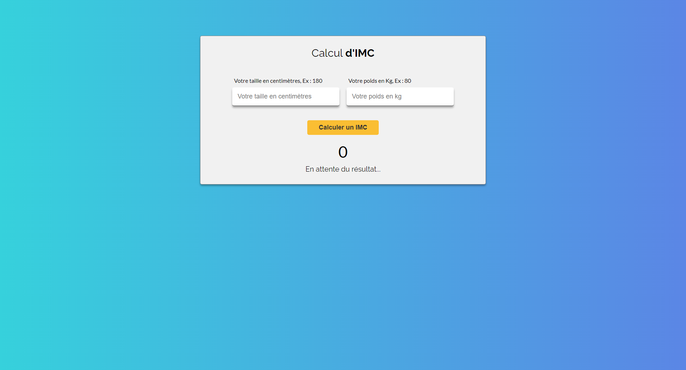

# Udemy - 20 javascript projects - BMI calculator app

This is a solution to the [BMI CALCULATOR from Udemy](https://www.udemy.com/course/20-projets-en-javascript/).

## Table of contents

- [Overview](#overview)
  - [The challenge](#the-challenge)
  - [Screenshot](#screenshot)
  - [Links](#links)
- [My process](#my-process)

  - [Built with](#built-with)
  - [What I learned](#what-i-learned)
  - [Continued development](#continued-development)

- [Author](#author)

## Overview

### The challenge

Users should be able to:

- View the optimal layout for the app depending on their device's screen size
- See hover states for all interactive elements on the page
- Manage the inputs, find their value in your script when you click on the button.
- Do basic validation, prevent calculation if the user leaves one or two entries empty.
  Also show a message to inform him of the error (ex: "Please fill in the entries").
- Calculate the BMI with the values ​​entered.
- Calculate BMI rank against "BMIData"
- Fill in the interface according to the results

### Screenshot

### Links

- Solution URL: [Github link](https://github.com/Stv-devl/BMI-calculator-fr)
- Live Site URL: [Live link](https://stv-devl.github.io/BMI-calculator-fr/)

## My process

### Built with

- Semantic HTML5 markup
- CSS custom properties
- Flexbox
- CSS Grid
- Mobile-first workflow
- SASS / SCSS
- Vanilla JS

### What I learned

I learned to practice javascript.

### Continued development

## Author

- Website - [Github](https://github.com/Stv-devl)
